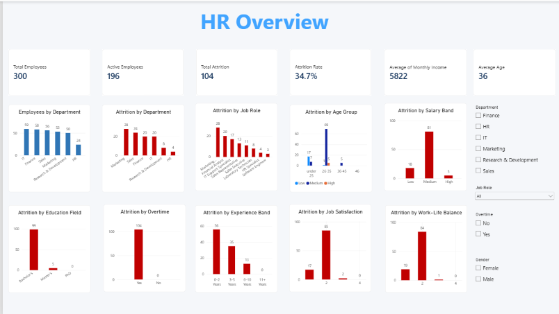
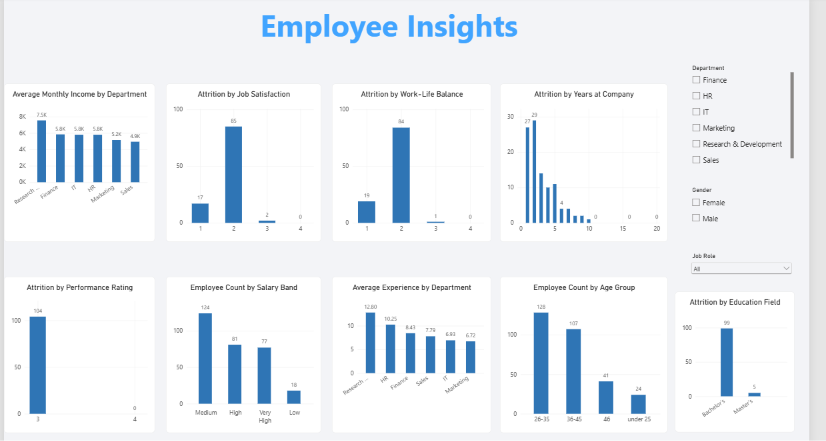

# HR Analytics – Employee Attrition Analysis

## About the Project

This project is an HR Analytics dashboard created using Power BI to understand employee attrition and different factors related to the workforce.

The dashboard provides an interactive view of employee data and helps identify patterns based on department, job role, salary, age, experience, job satisfaction, work-life balance, and performance.

## Project Objective

The main goal of this project is to use employee data to answer common HR-related questions such as:

- How is employee attrition distributed across departments?
- Which job roles have higher attrition?
- How does job satisfaction relate to attrition?
- How does work-life balance affect attrition?
- How are employees distributed across different age groups?
- How does salary level vary across employees?
- What is the relationship between experience and attrition?

## Tools Used

- Power BI
- Power Query
- DAX
- Microsoft Excel

## Dashboard

### Page 1 – HR Overview

The first page gives an overall view of the workforce.

It includes analysis of:

- Department
- Job Role
- Gender
- Overtime
- Employee distribution
- Key HR metrics

### Page 2 – Employee Insights

The second page provides more detailed employee analysis.

It includes:

- Average Monthly Income by Department
- Attrition by Job Satisfaction
- Attrition by Work-Life Balance
- Attrition by Years at Company
- Attrition by Performance Rating
- Average Experience by Department
- Employee Count by Age Group
- Attrition by Education Field
- Employee Count by Salary Band

## Key Insights

Some of the main areas explored in this project are:

- Employee attrition patterns
- Department-wise employee trends
- Salary and income distribution
- Employee experience
- Age groups
- Job satisfaction
- Work-life balance
- Performance ratings
- Education fields

The dashboard makes it easier to compare these factors and understand where employee attrition may be higher.

## Dashboard Screenshots

### HR Overview



### Employee Insights



## Repository Structure

```text
HR-Analytics-Employee-Attrition-PowerBI/
│
├── Dashboard/
│   └── HR_Analytics_Employee_Attrition_Dashboard.pbix
│
├── Dataset/
│   └── HR_Analytics_Dataset.xlsx
│
├── Screenshots/
│   ├── Page1_HR_Overview.png
│   └── Page2_Employee_Insights.png
│
└── README.md
```
